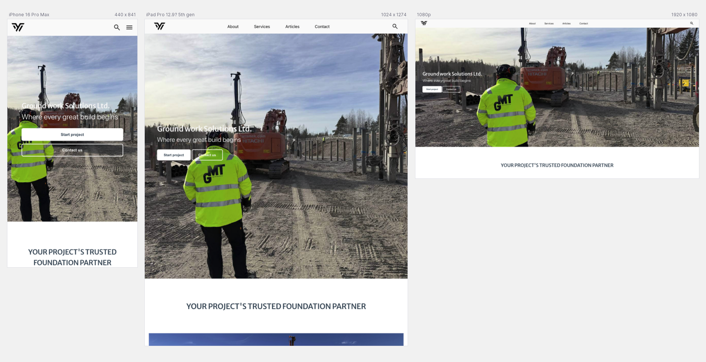

# Groundwork Solutions

This website provides an instant preliminary cost estimate for construction groundwork projects, specifically for Groundwork Solutions Ltd. It aims to streamline the initial client interaction by offering a transparent and efficient way to get an early understanding of project costs.

<a href="https://luckyfrappe.github.io/groundwork/" aria-label="Groundwork Solutions Ltd. website opens in a new window on Github Pages">View Groundwork Solutions Ltd. on Github Pages</a>

## CONTENTS

<!-- Test all links -->
<!-- Check _blank does not work -->
- [User Experience (UX)](#user-experience-ux)
  - [Business Goals](#business-goals)
  - [User Stories](#user-stories)
- [Design](#design)
  - [Color Scheme](#color-scheme)
  - [Typography](#typography)
  - [Imagery](#imagery)
  - [Wireframes](#wireframes)
- [Features](#features)
  - [Common to All Pages](#common-to-all-pages)
  - [Page-Specific Features](#page-specific-features)
  - [Future Implementations](#future-implementations)
  - [Accessibility Considerations](#accessibility-considerations)
- [Technologies Used](#technologies-used)
  - [Languages Used](#languages-used)
  - [Frameworks, Libraries & Programs Used](#frameworks-libraries--programs-used)
- [Deployment & Local Development](#deployment--local-development)
  - [Deployment](#deployment)
  - [Local Development](#local-development)
    - [How to Fork the Repository](#how-to-fork-the-repository)
    - [How to Clone the Repository](#how-to-clone-the-repository)
- [Testing](#testing)
- [Credits](#credits)
  - [Code Used](#code-used)
  - [Content](#content)
  - [Media](#media)
  - [Acknowledgments](#acknowledgments)

## User Experience (UX)

### Business Goals

- The main goal of this website is to provide clients with an instant preliminary cost estimate for construction groundwork projects in Sweden.
- Build a professional web-based MVP that supports lead generation.
- Clearly communicate Groundwork Solutions Ltd.'s value and services.
- Encourage visitors to take action through clear Call to Actions (CTAs) to get a finalized quote.

### User Stories

**As a first-time visitor, I want the site to be easy to access and navigate, so I want to use it.**

- Works well on desktop, tablet, and mobile.
- Clear and simple navigation.
- Layout doesn’t break or overlap at any screen size.

**As a potential client, I want to quickly get a cost estimate for my groundwork project, so I can plan my budget.**

- An interactive front-end form to input project details.
- A live estimation engine that calculates costs based on inputs.
- A results page displaying a service-by-service cost breakdown and a total estimated price range.

**As a potential client, I want to understand what services Groundwork Solutions Ltd. offers, so I can check if it fits our needs.**

- A section that lists main services with short titles and clear descriptions.

**As a decision-maker, I want to know Groundwork Solutions Ltd. is reliable, so I can feel good about using it.**

- An "About Us" section detailing the company's approach and expertise.

**As a lead, I want to easily reach out for a finalized quote, so I can get started.**

- A clear CTA on the results page to "Send us your details for a finalized quote."
- A visible contact section with essential company info and links.

**As a general and returning visitor, I want to quickly find contact details, so I can reach out.**

- A visible contact section.
- Footer with essential company info and links.

## Design

### Color Scheme

<!-- Add adobe https://color.adobe.com/create/color-wheel -->

This project's design aims for a professional and clean aesthetic, utilizing a specific color palette that reflects the construction industry's robustness while maintaining a modern feel.

### Typography

<!-- Adjust - For typography, Merriweather Sans (sourced from Google Fonts) is employed for all headings, lending a distinct yet web-friendly appeal. Roboto Flex (also from Google Fonts) is used for paragraph text, ensuring readability and a professional, modern feel. -->

### Imagery

Visual content, including images and videos, aims to evoke a sense of professionalism and the scale of groundwork projects. Imagery includes construction sites, heavy machinery, and relevant diagrams. Additional royalty-free images were sourced from Pexels and Unsplash. Full author credits for all assets can be found in the dedicated [Credits section](#credits) of this project.

### Wireframes

<!-- Project started withour wireframes -->

## Features

This website is designed to provide a seamless and professional experience for obtaining groundwork project estimates, offering a robust set of features across its key sections:

### Common to All Pages

- **Responsive Navigation Bar:** Top navigation bar ensures intuitive site navigation. It features the Groundwork Solutions Ltd. branding and essential links (Home, Services, About, Contact). <!-- For an optimal user experience on mobile devices, the navigation condenses into a universally recognized burger menu, maintaining a clean interface. -->
- **Footer:** A functional footer houses social media icon links (e.g., YouTube, Facebook, Twitter, LinkedIn, Instagram) and privacy policy information. Icons are chosen for their universal recognition and minimalist design.

### Page-Specific Features

**Landing Page:**

- **Hero Section:** Large hero image, intro heading, two CTA buttons.
<!-- Add hero image -->
- **Introduction Section:** Card layout with image + content and link to learn more.
<!-- Add introduction image -->
- **Articles Section:** Highlighting company mission and values through article cards.
- **Services Teaser:** Service cards with clear titles and summaries.
<!-- Add services image -->
- **Customer Journey and Contact Section:** Step-by-step visual breakdown of client process from estimate to delivery.
  <!-- Add image -->

<!-- To be created -->
**Estimate Form (Multi-Step):**

<!-- https://css-tricks.com/how-to-create-multi-step-forms-with-vanilla-javascript-and-css/ -->

- **Step 1 of 4: Project Basics:** Gathers high-level information like project type, location, and an optional project reference.
<!-- Add image -->
- **Step 2 of 4: Required Services:** Allows users to select all required services via checkboxes (Excavation & Site Prep, Piling & Foundation Reinforcement, Concrete Slab / Foundation, Shoring & Retaining Walls, Rock Handling & Blasting, Drainage System, Frost Insulation, Site Setup & Project Management).
<!-- Add image -->
- **Step 3 of 4: Project Specifications:** Dynamically displays fields based on selected services, such as site area, excavation depth, number of piles, and drainage system length. Includes an option for users to indicate if they are unsure about the number of piles.
<!-- Add image -->
- **Step 4 of 4: Timeline & Contact:** Covers project urgency (Standard or Rush with a +20% fee) and captures contact details (Full Name, Company Name, Email Address, Phone Number). Includes a consent checkbox for data storage.
<!-- Add image -->
- **Live Estimation Engine (JavaScript Logic):** Calculates costs based on user inputs and provided price ranges for each service, including excavation volume, service costs, and a fixed site management fee. Applies a +20% surcharge for "Rush" projects.
<!-- Add image -->

<!-- To be created -->
**Results & Summary Page:**

- Displays a service-by-service cost breakdown.
<!-- Add image -->
- Shows the total estimated price range (e.g., "11.8M – 25.1M SEK").
<!-- Add image -->
- Includes a clear Call to Action (CTA) like: "<!-- Send us your details for a finalized quote. -->"
<!-- Add image -->

### Future Implementations

Future implementations could include:

- **Use historical project data for more accurate estimates.**
- **Integrate a system to automatically request quotes from suppliers.**
- **Develop an admin dashboard for Groundwork Solutions Ltd. to manage and track all quotes.**
- **Services Page - Presents a comprehensive list of Groundwork Solutions Ltd.'s services, enhanced with appropriate images.**
- **Articles/Portfolio Page**
- **Contact form page.**
- **About us page.**
- **Blog system for industry news/articles.**
- **Multilingual support for international users.**
- **User login system for saving projects.**

### Accessibility Considerations
  - **Semantic HTML:** Utilizing meaningful HTML tags to ensure proper document structure for assistive technologies.
  - **Descriptive Alt Attributes:** All images include descriptions for screen reader users.
  - **Color Contrast:** 

## Technologies Used

### Languages Used

HTML, CSS and Javascript.

### Frameworks, Libraries & Programs Used

- **Git:** For version control.
- **Github:** To save and store the files for the website.
- **Google Fonts:** Import fonts (Merriweather Sans for Headings, Roboto Flex for Paragraphs).
- **Google Dev Tools:** Development.
- **Font Awesome:** Import icons.
- **FreeConvert:** To downsize and convert the hero video.
- **Favicon.io:** To create favicon.
- **Tiny PNG:** To downsize the images.
- **Polypane:** To showcase the website on different devices.
  <!-- - **Autoprefixer CSS online:** Applied to add necessary vendor prefixes to CSS properties, ensuring broader browser compatibility. -->
- **ChatGPT (by OpenAI):** Used for generating specific service and feature descriptions, ensuring industry relevance and authenticity in the website's content.
- **Gemini (by Google):** Providing extensive debugging assistance and code explanations during development.
- **ColorSpace:** Used to generate matching Color Palette 

## Deployment & Local Development

  
Deployment

  

    This project's live version is deployed using **GitHub Pages**. Follow these steps to deploy your own instance:

1.  **Access GitHub:** Sign in to your GitHub account.
2.  **Navigate to Repository:** Locate the `groundwork` repository for this project.
3.  **Open Settings:** Click on the "Settings" tab within the repository navigation.
4.  **Go to Pages:** In the left-hand sidebar, select the "Pages" option.
5.  **Configure Source:**
    - Under the "Source" section, choose the `main` branch from the branch dropdown menu.
    - Select `/(root)` as the folder from the adjacent dropdown.
6.  **Save Changes:** Click the "Save" button. Your live site will now be accessible at the URL provided by GitHub Pages, typically `https://github.com/luckyfrappe/groundwork`.
  

### **Local Development**

To get a local copy of this project up and running on your machine, you have two primary methods: Forking and Cloning.

  
How to Fork the Repository

  

    Forking creates a personal copy of the repository in your GitHub account, allowing you to make changes without affecting the original project.

1.  Sign In: Log in to your GitHub account.
2.  Go to Project: Visit the `luckyfrappe/groundwork` repository.
3.  Initiate Fork: Click the "Fork" button located in the top-right corner of the page. This will create a copy under your own GitHub profile.
  

  
How to Clone the Repository

  

    Cloning downloads a full copy of the repository to your local computer, ready for development.

1. Access GitHub: Ensure you are logged into your GitHub account.
2. Locate Repository: Navigate to the `luckyfrappe/groundwork` repository (or your forked version).
3. Copy Clone URL: Click on the green "< > Code" button. Choose your preferred method (HTTPS, SSH, or GitHub CLI) and copy the provided URL.
4. Open Terminal: Launch your terminal or command prompt (e.g., Git Bash, PowerShell, macOS Terminal).
5. Navigate to Desired Directory: Change your current working directory to where you want to store the project.
   Example: `cd Desktop/Projects`
6. Execute Clone Command: Type `git clone` followed by pasting the URL you copied in step 3. Press Enter.
Example: `git clone https://github.com/luckyfrappe/groundwork`
  

## Testing

For testing details, known issues, and resolved bugs, see [TESTING.md](TESTING.md).

## Credits

### Code Used

- <a href="https://fonts.google.com/">Google Fonts</a>: Used for custom typography — <em>Merriweather Sans</em> for headings and <em>Roboto Flex</em> for paragraph text. 
- <a href="https://fontawesome.com/">Font Awesome</a>: Integrated via CDN to provide scalable vector icons throughout the site. 
- <a href="https://codesandbox.io/p/sandbox/responsive-card-layout-with-css-grid-rpfdn?file=%2Fstyles.css%3A82%2C1-110%2C2">Responsive Card Layout</a>: Inspired by a layout example from CodeSandbox. 
- HTML Reset & Base Structure: Generated with assistance from ChatGPT to establish clean default styling and structure. 
- <a href="https://www.youtube.com/watch?v=U8smiWQ8Seg">Responsive Navbar Concept</a>: Initially based on a YouTube tutorial, but significantly modified and rebuilt to suit the project’s design.

### Content

The textual content and overall narrative of this fictional website were developed collaboratively by the developer with support from AI tools. Descriptions of services, features, and general website copy were generated with the assistance of ChatGPT (by OpenAI) and Gemini (by Google). Inspiration for the content was drawn from the website <a href="https://gmt-ab.se/">gmt-ab.se</a> 

### Media

- All images were provided by a friend who works as construction supervisor at <a href="https://gmt-ab.se/">gmt-ab.se</a>. 
- <strong>Favicons:</strong> Generated using <a href="https://favicon.io/">Favicon.io</a>. 
- <strong>Color Palette:</strong> Generated using <a href="https://mycolor.space/">ColorSpace</a>. 
- <strong>Image Optimization:</strong> Images were compressed and optimized using <a href="https://tinypng.com/">Tiny PNG</a>. 
- <strong>Responsive Showcase Image:</strong> The screenshot demonstrating website responsiveness was created using <a href="https://polypane.app/">Polypane</a>. 
- <strong>Canva:</strong> Used to create the logo via <a href="https://www.canva.com/">Canva</a>.

### Acknowledgments

<!-- Add Acknowledgments -->
