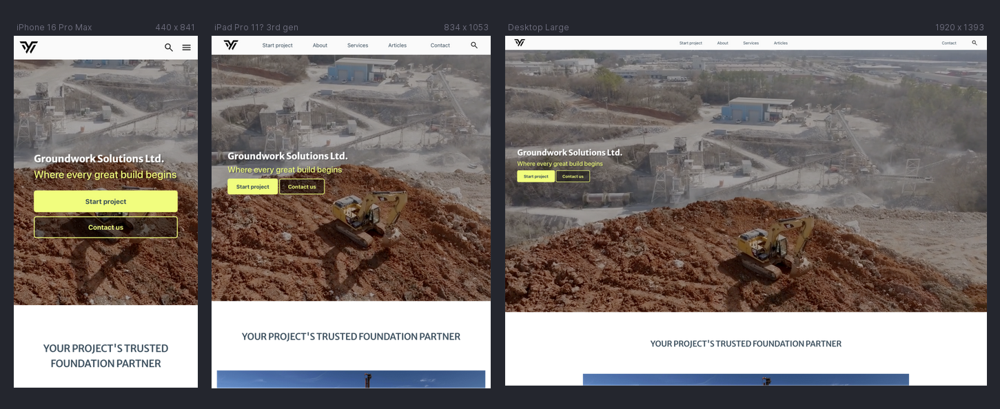

# Groundwork Solutions

This website provides an instant preliminary cost estimate for construction groundwork projects, specifically for **Groundwork Solutions Ltd.** The primary goal is to streamline the initial client interaction by offering a transparent and efficient way for potential customers to get an early understanding of project costs.

🔗 **Live site:** <https://luckyfrappe.github.io/groundwork/>

---

## Contents

- [User Experience (UX)](#user-experience-ux)
  - [Business Goals](#business-goals)
  - [User Stories](#user-stories)
- [Design](#design)
  - [Color Scheme](#color-scheme)
  - [Typography](#typography)
  - [Imagery](#imagery)
  - [Wireframes](#wireframes)
- [Features](#features)
  - [Common to All Pages](#common-to-all-pages)
  - [Page-Specific Features](#page-specific-features)
  - [Future Implementations](#future-implementations)
  - [Accessibility Considerations](#accessibility-considerations)
- [Technologies Used](#technologies-used)
  - [Languages Used](#languages-used)
  - [Frameworks, Libraries & Programs Used](#frameworks-libraries--programs-used)
- [Deployment & Local Development](#deployment--local-development)
  - [Deployment](#deployment)
  - [Local Development](#local-development)
    - [How to Fork the Repository](#how-to-fork-the-repository)
    - [How to Clone the Repository](#how-to-clone-the-repository)
- [Testing](#testing)
- [Credits](#credits)
  - [Code Used](#code-used)
  - [Content](#content)
  - [Media](#media)
  - [Acknowledgments](#acknowledgments)

---

## User Experience (UX)

### Business Goals

- The main goal of this website is to provide clients with an instant preliminary cost estimate for construction groundwork projects.
- Build a professional web-based MVP that supports lead generation.
- Clearly communicate Groundwork Solutions Ltd.'s value and services.
- Encourage visitors to take action through clear Call to Actions (CTAs) to get a finalized quote.

### User Stories 
As a developer, I focused on addressing the needs of key users, including first-time visitors, potential clients, and returning users.  

**As a first-time visitor, I want the site to be easy to access and navigate.**  
- The site works seamlessly across desktop, tablet, and mobile devices.  
- Navigation is clear and simple, with a responsive layout that remains functional at all screen sizes.  

**As a potential client, I want to quickly get a cost estimate for my groundwork project.**  
- The site features an interactive, multi-step form for inputting project details.  
- A live estimation engine calculates costs based on user inputs.  
- The final step provides a service-by-service cost breakdown and a total estimated price range.  

**As a potential client, I want to understand what services are offered.**  
- A dedicated section lists the main services with clear titles and descriptions.  

**As a decision-maker, I want to know Groundwork Solutions Ltd. is reliable.**  
- An "About Us" section details the company's approach and expertise.  

**As a lead, I want to easily reach out for a finalized quote.**  
- A clear CTA is provided at the end of the form to encourage users to send their details.  
- A visible contact section with essential company information is included.  

**As a general and returning visitor, I want to quickly find contact details.**  
- Contact information is easily accessible via a dedicated section and the site-wide footer.  

## Design

### Color Scheme

<!-- Add adobe https://color.adobe.com/create/color-wheel -->

This project's design aims for a professional and clean aesthetic, utilizing a specific color palette that reflects the construction industry's robustness while maintaining a modern feel.

### Typography

Merriweather Sans (from Google Fonts) is used for all headings, providing a distinct, professional look. Roboto Flex (also from Google Fonts) is used for all body text, ensuring readability and a modern, clean feel.

### Imagery

Visual content, including images and videos, aims to evoke a sense of professionalism and the scale of groundwork projects. I sourced imagery, including construction sites, heavy machinery, and relevant diagrams, from a friend who works in the industry, as well as from royalty-free platforms like Pexels and Unsplash. Full author credits for all assets can be found in the dedicated [Credits](#credits).

### Wireframes

I did not create formal wireframes for this project. Instead, due to my limited experience in design, I chose to follow detailed video guides for the multi-step form and navigation. I then customized the visual styling of these components to fit my own design needs and overall project aesthetic. This approach allowed me to build a complex, functional application while learning about modern web layouts and development practices.

---

## Features

This website provides a seamless and professional experience for obtaining groundwork estimates.

### Common to All Pages

**Responsive Navigation Bar:** The top navigation bar ensures intuitive site navigation. It features the Groundwork Solutions Ltd. branding and essential links. For an optimal user experience on mobile, the navigation condenses into a universally recognized burger menu.

**Footer:** A functional footer houses social media icon links (e.g., YouTube, Facebook, Twitter, LinkedIn, Instagram), and privacy policy information. Icons are chosen for their universal recognition and minimalist design.

**Animations**  
- On all pages, some elements appear with a smooth animation when you scroll to them.  
- When you scroll past them, the animation effect disappears.  

**Sidebar Navigation**  
- The sidebar menu can be opened and closed.  
- Clicking on any link in the sidebar automatically closes it.  
- This behavior is the same on every page.

### Page-Specific Features

**Landing Page:**

- Hero section with video, heading, and CTAs.
- Introduction section with card layout.
- Articles highlighting mission and values.
- Services teaser with summaries.
- Customer journey and contact section.

**Estimate Form (Multi-Step)**

The form is designed as a guided, step-by-step process with validation, progress tracking, and dynamic fields.

**Step 1 – Worksite Overview**  
- Start by creating at least one worksite.  
- Each worksite can be **added or deleted dynamically**.  
- Each worksite will later hold its own set of required services and specifications.
- Validates name(s) for worksites is intered before proceeding. 

**Step 2 – Contact Information**  
- Collects name, company (optional), email, and phone number (optional).  
- Validates email format before proceeding.
- Validates name is not just a space. 

**Step 3 – Project Basics**  
- Captures project type (dropdown), location, and internal reference (optional).  
- Allows optional upload of a project plan or photo.
- Validates input on required fields before proceeding.

**Step 4 – Required Services**  
- Each worksite has its own services checklist.  
- Available services:  
  - Excavation & Site Prep  
  - Piling / Foundation  
  - Concrete Slabs / Foundation  
  - Shoring / Retaining Walls  
  - Rock Breaking / Blasting  
  - Drainage System  
  - Frost Insulation  
  - Rush Delivery (+20% surcharge applied later) - can not be selected as service on it's own. 
- At least one service must be selected per worksite.

**Step 5 – Specifications**  
- Expands into detailed input fields based on the services chosen.  
- Uses accordion panels for each worksite.  
- Examples:  
  - Excavation → site area + excavation depth  
  - Piling → number of piles + total pile length  
  - Concrete slabs → area + thickness  
  - Drainage, frost insulation, shoring, and rock blasting → lengths/areas/volumes as required  
- Always includes optional soil volume, material breakdown, and notes.

**Step 6 – Summary & Submission**  
- Displays collected **Contact Info** and **Project Details**  
- Shows a **Worksite-by-Worksite Cost Breakdown**, including min–max ranges  
- Applies rush surcharge if selected  
- Updates totals dynamically before submission
- Includes a mandatory consent checkbox.

**Additional Features**  
- **Progress Bar:** Updates as the user moves through the steps  
- **Navigation Control:** Next/Previous buttons adapt depending on step  
- **Validation:** Required fields and at least one service per worksite must be filled before moving forward  
- **Dynamic Sites:** Users can add or remove worksites with their own services and specifications

**404 Page**  
- This page appears when the user tries to visit a URL that doesn't exist.  
- It shows a clear message: "404 - Page Not Found" and explains that the page may have moved or doesn’t exist.  
- There is a button that allows the user to return to the homepage easily.  
- The header and sidebar navigation are still available, so users can access other sections of the site.  
- The footer provides contact information, office hours, and social media links, keeping the user connected even on an error page.  
- Overall, it keeps the site’s branding consistent and helps users find their way back without frustration.

### Future Implementations

The multi-step estimation form is designed to streamline and standardize the quoting process for Groundwork Solutions Ltd.

**Future Enhancements Could Include:**  
- Automating quote requests from suppliers.  
- Developing an admin dashboard to manage and track all quotes.  
- Creating dedicated pages for Services, Articles/Portfolio, and About Us.  
- Implementing a blog system for industry news and updates.  
- Adding multilingual support for international users.  
- Introducing user accounts to save projects and continue estimates later.  
- **PRO Mode:** Provide an editable “Excel sheet” for employees to generate highly accurate quotes internally. It ensures that each step of gathering project details is counted, reducing errors compared to manual calculations in Excel or on paper. This consistent workflow allows for high accuracy, easier training for employees, and potential automation using AI. By storing historical project data and refining questions, estimates become progressively more precise over time. New employees can just use the multi-step wizzard. 
- Integrating a database of past offers and project costs to enhance pricing accuracy.  
- **AI Integration:** Automatically read and populate form fields from uploaded Excel files, with user confirmation.  
- Shift to **TDD/BDD** for automated testing and improved code quality.  
- Enhance animations with a “Power in Motion” strategy, including hero videos, scroll-triggered effects, and a unified construction-themed design.  
- Improve usability with interactive elements: animated counters, project case studies, and meaningful hover effects.  
- Implement more granular calculation options (e.g., rush-level coefficients, service-specific multipliers) for precise estimates.  
- Add advanced interactive visuals like animated geometric lines or mouse-tracking spline figures for a dynamic, polished feel.  

This approach ensures a fully standardized, accurate, and scalable quoting workflow that can evolve with AI and data-driven improvements.

### Accessibility Considerations

- Semantic HTML: Meaningful HTML tags are used to ensure proper document structure for assistive technologies.
- Descriptive Alt Attributes: All images include descriptive alt attributes for screen reader users.
- Radio buttons are wrapped in fieldset with legend name.
- Color Contrast: Colors were selected to ensure sufficient contrast for readability.

---

## Technologies Used

### Languages Used

- **HTML**
- **CSS**
- **JavaScript**

### Frameworks, Libraries & Programs Used

- **Git & GitHub** – Version control and hosting.
- **Google Fonts** – Typography.
- **Google DevTools** – Development & debugging.
- **Font Awesome** – Icons via CDN.
- **FreeConvert** – Video compression.
- **Favicon.io** – Favicon generation.
- **TinyPNG** – Image optimization.
- **Polypane** – Responsive device previews.
- **Autoprefixer** – Vendor prefixes for CSS.
- **ColorSpace** – Palette generation.
- **[JSLint](https://jshint.com/)** – JavaScript validation.
- **jshint** - https://jshint.com/
- **Custom JS Lint API** – <https://luckyfrappe.github.io/jsapi/>
- **ChatGPT (OpenAI) & Gemini (Google)** – ChatGPT (OpenAI) & Gemini (Google) – Used for generating service descriptions, debugging support, exploring different approaches, and clarifying code concepts during development. 

During the project, these AI tools were used as supportive resources for:
Brainstorming approaches to form validation and error handling.
Debugging JavaScript event listeners.
Exploring different approaches for small code snippets (e.g., form validation logic), later fully implemented and adapted by the author.

---

## Deployment & Local Development

  
Deployment

  

    This project's live version is deployed using **GitHub Pages**. Follow these steps to deploy your own instance:

1.  **Access GitHub:** Sign in to your GitHub account.
2.  **Navigate to Repository:** Locate the `groundwork` repository for this project.
3.  **Open Settings:** Click on the "Settings" tab within the repository navigation.
4.  **Go to Pages:** In the left-hand sidebar, select the "Pages" option.
5.  **Configure Source:**
    - Under the "Source" section, choose the `main` branch from the branch dropdown menu.
    - Select `/(root)` as the folder from the adjacent dropdown.
6.  **Save Changes:** Click the "Save" button. Your live site will now be accessible at the URL provided by GitHub Pages, typically `https://github.com/luckyfrappe/groundwork`.
  

### **Local Development**

To get a local copy of this project up and running on your machine, you have two primary methods: Forking and Cloning.

  
How to Fork the Repository

  

    Forking creates a personal copy of the repository in your GitHub account, allowing you to make changes without affecting the original project.

1.  Sign In: Log in to your GitHub account.
2.  Go to Project: Visit the `luckyfrappe/groundwork` repository.
3.  Initiate Fork: Click the "Fork" button located in the top-right corner of the page. This will create a copy under your own GitHub profile.
  

  
How to Clone the Repository

  

    Cloning downloads a full copy of the repository to your local computer, ready for development.

1. Access GitHub: Ensure you are logged into your GitHub account.
2. Locate Repository: Navigate to the `luckyfrappe/groundwork` repository (or your forked version).
3. Copy Clone URL: Click on the green "< > Code" button. Choose your preferred method (HTTPS, SSH, or GitHub CLI) and copy the provided URL.
4. Open Terminal: Launch your terminal or command prompt (e.g., Git Bash, PowerShell, macOS Terminal).
5. Navigate to Desired Directory: Change your current working directory to where you want to store the project.
   Example: `cd Desktop/Projects`
6. Execute Clone Command: Type `git clone` followed by pasting the URL you copied in step 3. Press Enter.
Example: `git clone https://github.com/luckyfrappe/groundwork`
  

## Testing

See **[TESTING.md](TESTING.md)** for test cases, known issues, and resolved bugs.

---

## Credits

### Code Used

- **Google Fonts** – <https://fonts.google.com/>
- **Font Awesome** – <https://fontawesome.com/>
- **Responsive Card Layout (CodeSandbox)** – <https://codesandbox.io/p/sandbox/responsive-card-layout-with-css-grid-rpfdn>
- **Responsive Navbar Concept (YouTube)** – <https://www.youtube.com/watch?v=U8smiWQ8Seg>
- **Scroll Behavior – MiladiCode (YouTube) and initial HTML/CSS structure, fully rewritten and customised by me** – <https://www.youtube.com/watch?v=ukMPKm3cLns&t=2386s>
- **Responsive Multi-Step Form – dotWebdesign (YouTube), partially rewritten and customised by me** – <https://www.youtube.com/watch?v=M0O-vquFHto&t=2373s>
- **Progress Bar Wrapper – WeiChiaChang (Gist), modified and integrated into project by me, then improved by Copilot** – <https://gist.github.com/WeiChiaChang/abe92ca2e8da86ef69560b63903e8764>
- **Accordion – W3Schools** – <https://www.w3schools.com/howto/howto_js_accordion.asp>
- **IntersectionObserver Guide (YouTube)** – <https://www.youtube.com/watch?v=T33NN_pPeNI>
- **Email Regex (Stack Overflow)** – <https://stackoverflow.com/questions/50330109/simple-regex-pattern-for-email>

### Content

The textual content and overall narrative of this fictional website were developed collaboratively with AI tools. Descriptions of services and general copy were generated with assistance from ChatGPT and Gemini. Inspiration for the content was drawn from the website gmt-ab.se.

### Media

- **Hero Video:** Pexels – <https://www.pexels.com/video/aerial-view-of-excavator-working-at-construction-site-30911527/>
- **Images:** Provided by a construction supervisor at **[gmt-ab.se](https://gmt-ab.se/)**.
- **Favicons:** **[Favicon.io](https://favicon.io/)**
- **Color Palette:** **[ColorSpace](https://mycolor.space/)**
- **Image Optimization:** **[TinyPNG](https://tinypng.com/)**
- **Responsive Showcase:** **[Polypane](https://polypane.app/)**
- **Logo:** Created with **[Canva](https://www.canva.com/)**

### Acknowledgments

I'd like to extend my sincere thanks to the creators of the video tutorials and the platforms mentioned in the credits, as their work was instrumental in the development of this project. Special thanks to my friend at gmt-ab.se for providing the project images.