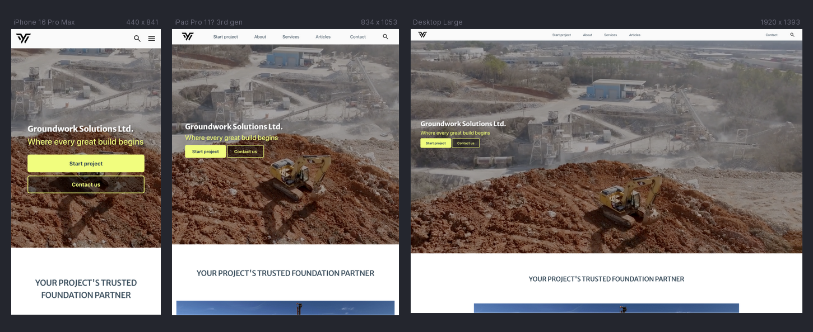
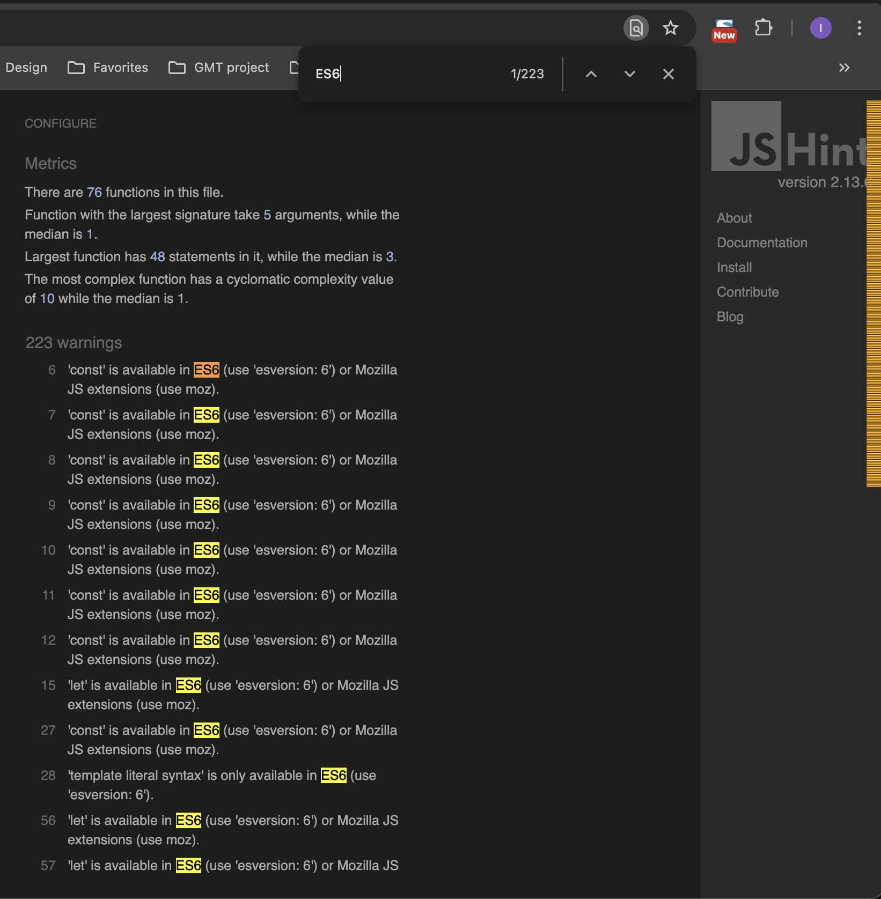

# Groundwork Solutions - Testing Documentation

<a href="https://luckyfrappe.github.io/groundwork/" target="_blank" aria-labe="Groundwork website opens in a new window on Github Pages">View Groundwork Solutions on Github Pages</a>

Testing for this project was a continuous and integral part of the development process. Given the dynamic nature of the project and the absence of a pre-defined plan or formal documentation, a test-as-you-go approach was adopted. This methodology, while initially challenging, proved essential for incrementally identifying and resolving issues, ultimately ensuring the website's reliability and polish. The focus was on achieving pixel-perfect responsiveness and flawless feature functionality across all stages of development.

## Contents
* [User Stories](#user-stories)
* [Automated Testing](#automated-testing)  
* [Manual Testing](#manual-testing)
* [Full Testing](#full-testing)
* [Bugs](#bugs)  
    * [Known Bugs](#known-bugs)  
    * [Solved Bugs](#solved-bugs)  

### User Stories

| User Story | Test Case | Expected Outcome | Pass/Fail |
|------------|-----------|-----------------|-----------|
| As a first-time visitor, I want the site to be easy to access and navigate. | 1. Access the live site from a desktop, tablet, and mobile device.2. Test navigation links (e.g., in the header and footer) across all devices. | The site displays correctly and navigation is simple to use on all devices.The navigation links function as intended. | Pass |
| As a potential client, I want to quickly get a cost estimate for my groundwork project. | 1. Navigate to the multi-step form and enter project details.2. Fill out all required fields and progress through each step.3. Verify the final summary page. | The form accepts and validates input correctly.The final summary page displays a comprehensive cost breakdown and a total estimated price range. | Pass | 
| As a potential client, I want to understand what services are offered. | 1. Navigate to the Services section on the landing page.2. Read the titles and descriptions provided for each service. | The services section is clearly visible on the landing page.The titles and descriptions accurately explain the services offered by the company. | Pass |
| As a decision-maker, I want to know Groundwork Solutions Ltd. is reliable. | 1. Access the "About Us" section on the landing page.2. Review the content detailing the company's approach and expertise. | The "About Us" section is easy to find.The content provides a clear and professional overview that inspires confidence in the company. | Pass |
| As a lead, I want to easily reach out for a finalized quote. | 1. Complete the multi-step form and reach the summary page.2. Locate the final Call to Action (CTA) and the contact information section. | A clear CTA is present on the summary page to submit details.A visible contact section with essential information is easily accessible. | Pass |
| As a general and returning visitor, I want to quickly find contact details. | 1. From any page on the site, scroll to the bottom.2. Locate the contact information section and the social media links. | The contact information is easily visible in the footer. Social media links are present and correctly linked. | Pass |

### Automated Testing

Automated tools were used throughout the project to ensure code quality and accessibility standards were met. This was a critical step in professionalizing the codebase.

**Google Lighthouse:**

<!-- Example screenshot of Lighthouse report for each section -->

| Page          | Performance | Accessibility | Best Practices | SEO | Notes               |
|---------------|------------|---------------|----------------|-----|-------------------|
| Homepage      | 77    | 100       | 100        | 91 | Largest Contentful Paint element 5,570 ms hero vide, which was downsized many times, further downsizing is affecting video quality |
| Start Project | 98    | 100       | 100        | 91 | [Add notes here] |
| 404 Page.     | 100    | 100       | 96        | 82 | [Add notes here] |

HTML & CSS Validation: The website's code was run through the official W3C validators to ensure it adheres to web standards. The HTML validator was used to check for proper syntax, correct nesting of elements, and semantic correctness. Similarly, the CSS validator was used to verify CSS syntax, property usage, and vendor prefix issues.

<!-- Example of W3C HTML & CSS validator reports -->

The JavaScript code was rigorously checked using JSLint and custom made JSHint to enforce coding standards and identify potential errors. Initially, over 160 warnings were flagged, primarily for minor formatting issues like single quotes and line length. These were systematically fixed. The number of warnings was reduced to just nine by standardizing quotes, shortening lines, and deleting trailing spaces. The final few warnings were addressed by refining function placement and resolving unnecessary semicolons. Remaining warnings are only due to use of ES6.

Autoprefixer: This tool was used to automatically add vendor prefixes to the CSS properties, ensuring the website's styles render correctly across a wide range of browsers. This step was essential for maintaining a consistent look and feel, even for older browser versions.

<!-- Screenshot of WAVE accessibility testing results -->

WAVE Accessibility Tool: The website was checked with the WAVE tool to identify accessibility issues. A single, acknowledged warning for redundant links was noted. This warning was deemed acceptable as the multiple CTAs intentionally point to the same URL in different sections to guide user flow.

### Manual Testing

Extensive manual testing was performed on various browsers and devices to validate the user experience.

Browser & Device Compatibility: The website was tested on multiple browsers (Chrome, Firefox, Safari) and devices (desktop, tablet, mobile) to ensure consistent layout, functionality, and responsiveness.

Feature Functionality: Every interactive element and feature was manually tested to confirm it works as expected. This included validating form field inputs, ensuring button clicks trigger the correct actions, and confirming dynamic content is generated and displayed properly.

**Common to all pages:**

| Test Number | Test Description | Expected Result | Actual Result | Pass/Fail |
|--------------|-----------------|----------------|---------------|-----------|
| **Scroll Animations** 001 | Initial State: Elements with the `.hidden` class are not visible on page load. | Elements with the `.hidden` class are not displayed or are in their initial hidden state (e.g., opacity: 0). | The elements are correctly hidden from view on load. | pass |
| 002 | Scroll Down: Elements with the `.hidden` class come into the viewport. | The `show` class is added, and the elements become visible with a smooth transition. | The elements animate into view as the user scrolls down. | pass |
| 003 | Scroll Up: An element that has been shown scrolls out of the viewport. | The `show` class is removed, and the element returns to its hidden state. | The animation class is correctly removed when the element is not in view. | pass |
| **Sidebar Navigation**004 | Show Sidebar: Click the hamburger menu icon. | The sidebar menu becomes visible by having its display property set to flex. | The sidebar slides into view as expected. | pass |
| 005 | Hide Sidebar (via 'X'): Click the 'X' icon (close button) within the sidebar. | The sidebar menu disappears by having its display property set to none. | The sidebar correctly hides. | pass |
| 006 | Hide Sidebar (via link): Click any navigation link within the sidebar. | The sidebar disappears, and the page navigates to the linked section. | The sidebar hides as the user navigates. | pass |

**Main page:**

| Test Number | Test Description | Expected Result | Actual Result | Pass/Fail |
|--------------|-----------------|----------------|---------------|-----------|
| **Header & Navigation** | Desktop: The header and navigation bar are correctly displayed at the top of the page. All navigation links (Start project, About, etc.) are visible. | The header is visible and all links are displayed. | The header is visible and all links are displayed. | pass |
| 002 | Desktop: Clicking the navigation links takes the user to the correct section of the page. | Clicking each link scrolls the page to its corresponding section. | Each link correctly navigates to its section. | pass |
| 003 | Desktop: The hamburger menu icon is hidden. | The hamburger menu icon is not visible on desktop. | The hamburger menu icon is correctly hidden. | pass |
| 004 | Mobile/Tablet: The hamburger menu icon is visible, and the regular navigation links are hidden. | The hamburger menu icon is visible, and the links are replaced by the icon. | The hamburger menu icon is visible, and the links are hidden. | pass |
| 005 | Mobile/Tablet: Tapping the hamburger icon displays the sidebar navigation. | The sidebar menu slides out and is fully visible. | The sidebar menu slides out as expected. | pass |
| 006 | Mobile/Tablet: Tapping a link within the sidebar navigation closes the sidebar and navigates the user. | The sidebar closes and the user is taken to the correct section of the page. | The sidebar closes and navigation is successful. | pass |
| 007 | Mobile/Tablet: Tapping the 'X' icon (close button) within the sidebar closes the sidebar. | The sidebar menu slides away and is hidden. | The sidebar menu correctly hides. | pass |
| **Hero Section** 008 | The looping video plays correctly on page load. | The video starts automatically and loops continuously without sound. | The video loads, plays, and loops correctly. | pass |
| 009 | The video overlay is visible, and the text is readable. | The text "Groundwork Solutions Ltd." and the slogan are clearly readable against the video. | The text is clear and easy to read. | pass |
| 010 | The "Start project" and "Contact us" buttons are visible and styled correctly. | The buttons are styled with the correct colors and text. | The buttons are styled and visible as intended. | pass |
| 011 | Clicking the "Start project" button redirects to new-project.html. | The user is taken to the correct page. | The redirection works as expected. | pass |
| **About Section** 012 | The section heading "YOUR PROJECT'S TRUSTED FOUNDATION PARTNER" is correctly displayed. | The heading is visible and correctly formatted. | The heading is visible and correctly formatted. | pass |
| 013 | The card with the image and text is displayed correctly. | The card is displayed with the image on the left and text on the right on desktop, or stacked on mobile. | The card is responsive and displays correctly on all screen sizes. | pass |
| **Services Section** 014 | The section heading and introductory paragraph are displayed correctly. | The heading and text are formatted and positioned as expected. | The heading and paragraph are displayed correctly. | pass |
| 015 | The two service cards (Groundworks and Structural Support) are displayed. | The cards with images, titles, and descriptions are visible. | All cards are visible and correctly formatted. | pass |
 **Articles Section** 016 | The section heading and three article cards are displayed correctly. | The heading and three cards with images, titles, and text are visible. | All cards and the heading are correctly displayed. | pass |
| **Project Journey Section** 017 | The section heading and the main card (Your Next Project) are displayed correctly. | The heading and the card with an image and text are visible. | The heading and card are displayed as intended. | pass |
| 018 | The 5-step process cards are displayed below the main card. | The five cards with numbers, titles, and icons are visible and correctly formatted. | The cards are visible and correctly formatted. | pass |
| **Footer** 019 | The footer is visible at the bottom of the page. | The footer is displayed and contains the correct information. | The footer is visible and all information is correct. | pass |
| 020 | All social media icons and links are working correctly. | Clicking each social link opens a new tab to the correct platform. | The links are all functional and open new tabs as expected. | pass |
| 021 | The contact details and address information are correct and clickable (if applicable). | The email and phone number are clickable and formatted correctly. | The contact details are correct and linked properly. | pass |
| **General Functionality** 022 | The defer and async attributes on the JavaScript files are applied correctly. | The JavaScript files do not block the parsing of the HTML, and the page loads quickly. | The page loads without delay, as the JavaScript is deferred. | pass |
| 023 | All images and icons load properly and display. | No broken image links or missing icons are present. | All images and icons are loaded correctly. | pass |
| 024 | Scroll-triggered animations work correctly on all elements with the .hidden class. | Elements slide in or fade in as they enter the viewport. | Animations trigger as expected on scroll. | pass |

**Start new project page:**

| Test Number | Test Description | Expected Result | Actual Result | Pass/Fail |
|--------------|-----------------|----------------|---------------|-----------|
| **Header & Footer**  | Header & Navigation: The header and navigation links should work as expected, including the mobile sidebar. | The header displays correctly and all links redirect to the correct sections on index.html. | The header and links function as intended. | pass |
| 002 | Footer: The footer is present at the bottom of the page with correct social links and contact info. | The footer is visible and all links are functional. | Footer is present and all links work correctly. | pass |
| **Step 0: Worksite Overview** 003 | Initial State: The form loads on "Worksite Overview" with the Single worksite radio button checked. | The form-zero div is active, and the Single worksite radio is pre-selected. | The correct form step is active with the radio button pre-selected. | pass |
| 004 | Multiple worksites option: Selecting Multiple worksites makes the Add another worksite button visible and adds an initial worksite field. | The Add another worksite button is shown, and the first worksite input field appears. | Button and field appear as expected. | pass |
| 005 | Add Worksite Functionality: Clicking the Add another worksite button adds a new worksite field. | A new worksite field appears below the previous one. | A new worksite field is added with each click. | pass |
| 006 | Delete Worksite Functionality: The 'Delete' button on a worksite field correctly removes it. | The worksite field is removed from the form. The delete button on the last remaining worksite field is hidden. | The delete button correctly removes the field, and the button on the final field hides. | pass |
| 007 | Navigation to Step 1: Clicking the Next Step button while on this step. | The form transitions to the "Contact Information" page. | The form successfully moves to the next page. | pass |
| **Step 1: Contact Information**  008 | Required Field Validation: Clicking Next Step without filling in required fields. | An alert message appears, and the empty fields are highlighted with a red border. | An alert message appears and the fields are highlighted. | pass |
| 009 | Email Validation: Entering an invalid email address and clicking Next Step. | An alert message appears, and the email field is highlighted with a red border. | An alert and highlight correctly appear for invalid emails. | pass |
| 010 | Back Button: Clicking Back returns to the previous step. | The form transitions back to the "Worksite Overview" page. | The form successfully transitions back. | pass |
| **Step 2: Project Basics** 011 | Required Fields: All required fields must be filled before proceeding. | The form only moves forward if Project Type and Project Location are filled. | The form successfully validates required fields. | pass |
| **Step 3: Services Selection**  012 | Dynamic Worksite Cards: A services card is displayed for each worksite defined in Step 0. | A unique services card appears for "Worksite 1", "Worksite 2", etc. | The cards are generated correctly for each worksite. | pass |
| 013 | Service Selection: Selecting services and clicking Next Step. | The form moves to the next step if at least one service is selected for each worksite. | The form successfully validates and moves to the next step. | pass |
| **Step 4: Specifications**  014 | Dynamic Accordion Panels: The accordion panels for each worksite should only contain input fields for services selected in the previous step. | For a worksite where "Excavation" was chosen, only the Excavation Depth field is present. | The dynamic fields are correctly generated for each worksite. | pass |
| 015 | Accordion Functionality: Tapping on an accordion button should reveal its content. | The accordion panel slides down to show the input fields. | The accordion panels open and close as intended. | pass |
| 016 | Required Field Validation: Empty required fields should trigger an alert and open the corresponding accordion panel. | An alert message appears, and the correct accordion opens to show the empty fields. | The validation works, highlighting fields and opening accordions. | pass |
| **Step 5: Summary & Submission** 017 | Summary Content: The summary page displays all previously entered data, including contact details, project basics, and a cost breakdown for each worksite. | All data is correctly displayed in the summary sections. | The summary page accurately reflects all input data. | pass |
| 018 | Total Calculation: The total estimated cost is calculated and displayed correctly, including any surcharges. | A total price range is shown at the bottom of the summary. | The total is calculated and displayed correctly. | pass |
| 019 | Submit Button: The Submit button is enabled only on the final step. | The Submit button is enabled and works on the summary page. | The button is correctly enabled and disabled based on the step. | pass |

**Multi-Step Form Test:**

| Test number | Test Description | Expected Result | Actual Result | Pass/Fail |
|--------------|-----------------|----------------|---------------|-----------|
| **Progress Bar & Navigation** 001 | Initial State: Progress bar starts at approximately 20% on page load. | The `progress-bar-fill` element has a width of approximately 20%. | The progress bar is almost empty. | pass |
| 002 | Progress Bar Update: Clicking "Next Step" advances the progress bar. | The progress bar's width increases with each step. | The progress bar updates correctly. | pass |
| 003 | Button States: "Back" button is disabled on the first step, and "Next" is disabled on the last step. | `prevButton` is disabled on step 0 and `nextButton` is disabled on step 5. | The buttons are correctly enabled/disabled. | pass |
| **Step 0: Worksite Overview** 004 | Radio Button Change: Switching from "single" to "multiple" worksites. | The Add another worksite button appears, and a new worksite field is added. | The UI correctly updates based on the radio button selection. | pass |
| 005 | Adding Worksites: Clicking Add another worksite adds a new input field. | A new input field with a corresponding 'Delete' button is added to the form. | A new worksite field is correctly added. | pass |
| 006 | Deleting Worksites: Clicking the 'Delete' button on a worksite. | The worksite field is removed. If only one remains, its delete button is hidden. | Deleting worksite fields works as expected. | pass |
| **Step 1: Contact Information**  007 | Form Binding: Inputting data into the contact form fields. | The `project.contact` object is updated in real-time with the input values. | The object is correctly updated. | pass |
| 008 | Email Validation: Entering an invalid email address. | An alert message appears, and the email input field is highlighted in red. | The email validation correctly flags invalid inputs. | pass |
| **Step 2 & 3: Project Basics & Services** 009 | Form Binding: Filling out project details and selecting services. | The `project.details` and `project.worksites` objects are updated with the selected data. | The data binding works as expected. | pass |
| 010 | Services Validation: Clicking Next Step without selecting a service for a worksite. | An alert message appears, preventing the user from advancing. | The validation correctly prevents advancement. | Pass |
| **Step 4: Specifications** 011 | Dynamic Fields: Accordion panels only show fields for services selected in Step 3. | If "Excavation" was selected, the 'Excavation Depth' input is visible; otherwise, it's hidden. | The form correctly generates fields based on selected services. | Pass |
| 012 | Accordion Functionality: Clicking an accordion button opens and closes the panel. | The panel expands and collapses smoothly. | The accordion functions correctly. | pass |
| 013 | Required Field Validation: Clicking Next Step with a required field left blank. | An alert message appears, and the corresponding accordion panel opens and highlights the empty field. | Validation correctly flags empty fields and opens the relevant accordion. | Pass |
| **Step 5: Summary** 014 | Summary Population: The summary page displays all user-entered data. | All contact, project, and worksite details are accurately shown on the summary page. | The summary is correctly populated with all data. | Pass |
| 015 | Total Calculation: The final cost is correctly calculated based on the entered data. | The displayed total price range is an accurate calculation of all services and specifications. | The final price calculation is correct. | Pass |
| 016 | Submit Button: The submit button is active only on the summary page. | The submit button is enabled on the summary and correctly sends the form data. | The button is correctly disabled/enabled. | Pass |
| 017 | Summary Population: The summary page displays all user-entered data from previous steps. | All contact, project, and worksite details are accurately populated into the summary sections (`summaryContact`, `summaryDetails`, `summarySites`). | All data is correctly displayed on the summary page. | Pass |
| 018 | Individual Site Costs: The estimated cost range for each worksite is displayed correctly. | The minimum and maximum costs for each site's selected services are calculated and shown as a price range (€X - €Y). | The cost ranges for each individual worksite are correctly calculated and displayed. | Pass |
| 019 | Site Setup & Management Costs: The additional setup and management costs are calculated and shown. | A cost range representing 10%-20% of the total worksite costs is calculated and displayed. | The site setup and management costs are calculated and displayed correctly. | Pass |
| 020 | Grand Total Calculation: The final grand total for the entire project is calculated and displayed. | The grand total is the sum of all individual worksite costs plus the site setup and management costs, shown as a final price range (€X - €Y). | The grand total is calculated and displayed correctly. | Pass |
| 021 | Accordion on Summary Page: The accordion button to view summary prices for each worksite functions correctly. | Clicking the accordion button reveals the detailed cost breakdown for that specific worksite. | The accordion functions as expected, showing and hiding details. | Pass |
| 022 | Consent Checkbox: The Submit button is enabled only when the consent checkbox is checked. | If the checkbox is unchecked, an alert is displayed, and the form submission is prevented. The Submit button is disabled. | The form correctly validates the consent checkbox, and the button's state changes accordingly. | Pass |
| **Form Submission** 023 | Successful Submission: The form is submitted after checking the consent box. | The form is replaced with a "Thank you" message and a link to return to the homepage. | The success message and link are correctly displayed upon submission. | Pass |
| 024 | Button Disabling: After a successful submission, all navigation buttons are disabled. | The `btn-prev`, `btn-next`, and `btn-submit` buttons become disabled to prevent further user interaction with the form. | All navigation buttons are correctly disabled after submission. | Pass |
| **Initialization** 025 | Page Load Initialization: The form and its associated data structures are correctly initialized on page load. | The progress bar, the first worksite field is added, and the project data object is populated with initial, empty worksite data. | The form correctly initializes, and all initial functions (`updateProgressBar`, `addWorksite`, etc.) are called as expected. | Pass |

### Full Testing

## BUGS

Almost all bugs were identified and successfully resolved throughout the development process. Here is a summary of key issues and their solutions, highlighting the problem-solving journey.

### Known Bugs

These are issues that have been identified but are out of scope for the current MVP.

-Cross-Site Scripting (XSS) Risk: The use of innerHTML to display user input, while convenient, presents a potential security risk. This needs to be refactored to use safer DOM manipulation methods.

### Solved Bugs

- Systematic Styling & Responsiveness Issues: Inconsistent spacing, non-standardized typography, and layout problems on various screen sizes have been resolved. A more systematic styling approach was implemented, leading to a cohesive and responsive design across all elements. The footer has also been redesigned to function and display properly.
- iOS/Safari Compatibility: The animations and videos, which previously failed to function correctly on iOS devices and in the Safari browser, have been debugged and fixed. The website now provides a consistent visual experience across these platforms.
- Piles Question Logic Fix: A problem with the logic for the "piles" question has been identified and corrected, leading to more accurate calculations for this service.
- Circle Misalignment in Progress Bar:
- The Bug: The circular step numbers in the form's progress bar were horizontally misaligned due to varying text lengths.
- The Cause: The `<ul>` element, a flex container with flex-direction: column, had align-items: center applied. In a column-based layout, this property controls horizontal alignment, causing the circles to shift based on text width.
- The Solution: The align-items: center property was removed from the `<ul>` element. The list was then wrapped in a `
` with a new class to manage its overall horizontal positioning. This change allowed the list items to align to the left by default, placing all circles in a straight vertical line.
- CSS Style Application Issue:
- The Bug: Styles for form elements were not being applied from the external CSS file, causing them to render with default browser styles.
- The Cause: The root cause of this issue was not definitively identified, but it seemed to be a caching or file-linking anomaly.
- The Solution: The problem was resolved by simply reapplying the same CSS rules directly to the external stylesheet after attempting and confirming they worked as inline styles.
- Accordion Script Unwanted Behavior:
- The Bug: The accordion script was causing unexpected behavior, such as wrapping one accordion inside another or failing to display panels correctly due to conflicts with a general "active" class.
- The Solution: The accordion logic was refactored into a dedicated wrapAccordions() function, which is called only when needed. The class name was changed from "active" to active-accordion to prevent conflicts with other active elements.
- Form Validation & Required Fields:
- The Bug: Clicking an accordion button triggered a form validation error, causing the view to jump to a required but hidden input. The issue was due to an overly broad selector.
- The Solution: The requiredFields selector was refined to specifically target only form input elements. Additionally, event.preventDefault() was added to the click listeners for both the accordion and navigation buttons, giving JavaScript full control over the form's behavior and preventing the browser's default validation.

Back to [README.md](README.md)